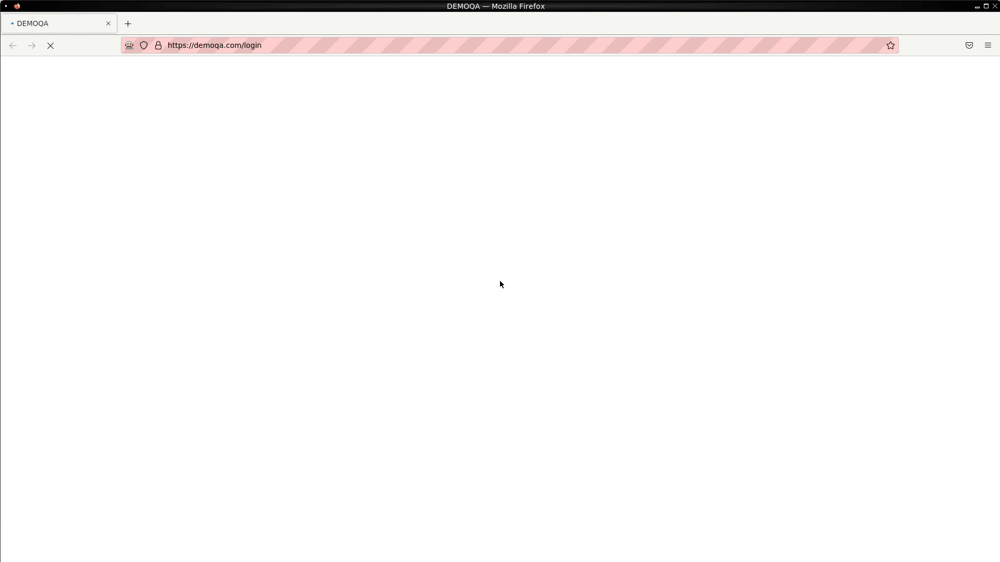
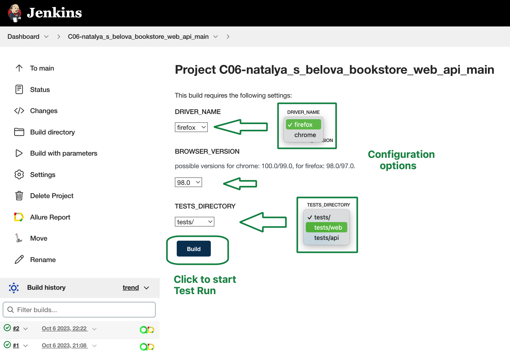
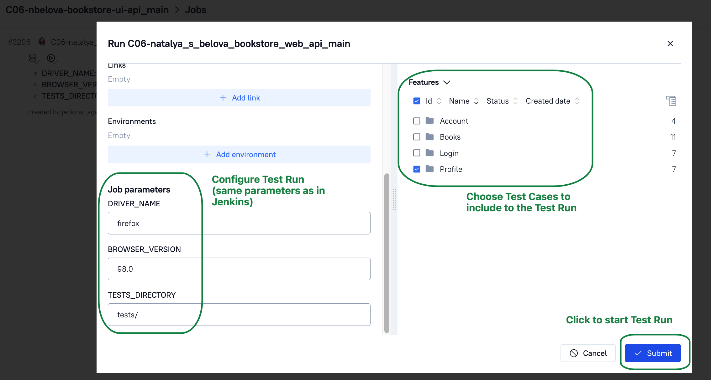
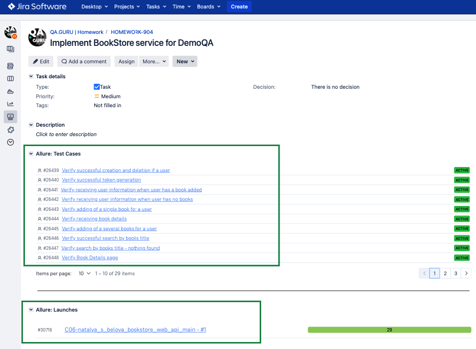

## Training project with Web and API autotests for [BookStore DemoQa](https://demoqa.com/books) service

&nbsp;

### Tools and technologies used

### Test coverage
UI-tests (web application):
* User's authorization
* Bookstore: search, navigate, view book details, add book to user's collection
* Profile: View, navigate, search, remove book(s) from the collection

API-tests:
* Account creation/deletion
* Token generation
* Receiving information about book's details
* Adding book(s) to user's collection
* Response's status codes
* Response's schemas

*Note: some web-tests are hybrid and use API requests (for example, to create/log in/delete user in order to reduce tests' running time and/or avoid CAPTCHA at registration).*

Example of Web test's running (successful login):

&nbsp;

Example of API request's test:

&nbsp;

### Test Launch
Tests are launching using **Jenkins service**.
To run tests, open the [configured job](https://jenkins.autotests.cloud/job/C06-natalya_s_belova_bookstore_web_api_main/), click 'Build with parameters', select browser + version (for example, firefox 98.0) and tests directory (web/api tests can be launched in the same run or separately), click 'Build'.

&nbsp;
&nbsp;

Also, since the integration with **Allure Test Ops** is implemented, it is possible to run tests with this service. 
In Allure Test Ops is also an additional ability to configure test scope by choosing specific test cases.

&nbsp;
&nbsp;

### Test Report and Test Documentation

Reporting is implemented using **Allure services**.

[Allure Report](https://jenkins.autotests.cloud/job/C06-natalya_s_belova_bookstore_web_api_main/allure/) can be opened on Jenkins page (see Jenkins screenshot in the section above) and contains graphics, detalization of test executions, different kinds of attachments (screenshots, logs, video, html code).
&nbsp;
&nbsp;

**Allure Test Ops** also contains such information and in addition it has generated Test Documentation that can be imported to Jira.
&nbsp;
&nbsp;

### Integration with Jira

Test Launches and Test Cases are integrated with Jira Task:
&nbsp;

### Test Results Notifications
As soon as Test Launch is completed, telegram message with the following information is sent:
* total amount of tests and run duration
* percentage of passed/failed/skipped/etc. tests
* link to the allure report

&nbsp;

For such messages to be sent, [notifications library](https://github.com/qa-guru/allure-notifications) was used, telegram bot was created and added to a specific telegram group.
